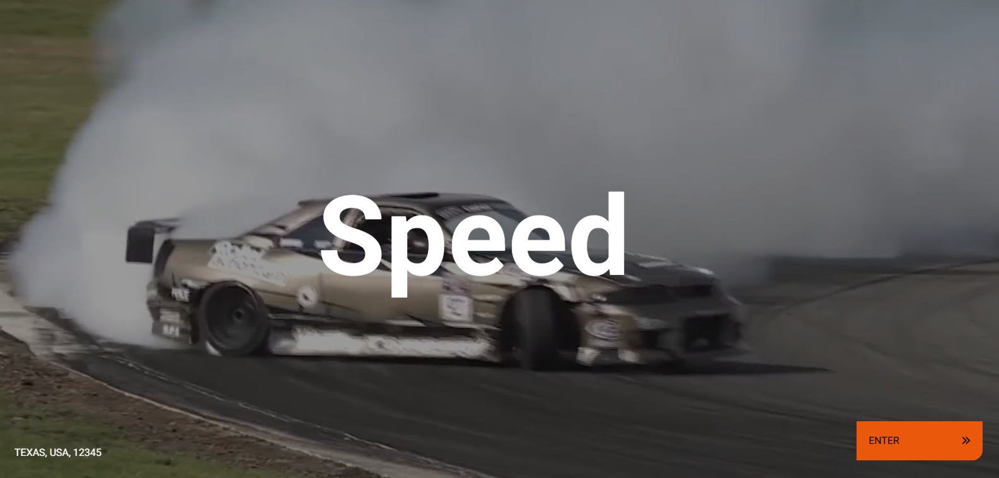

# Description

This project is built with **Next.js**, a powerful React framework that makes it **easy to create fast, SEO-friendly** websites with features like server-side rendering (SSR) and static site generation (SSG). The design is fully responsive, so it looks great and works perfectly on any screen size. To make it more engaging, I used the **GSAP (GreenSock Animation Platform) library to create a typewriter effect** that smoothly switches between a list of predefined words. It’s a great example of combining performance, flexibility, and modern animations to deliver a sleek and dynamic user experience.

# Main Features
- Next.js
- Typescript
- GSAP library
- Responsive Design

# Screenshot

